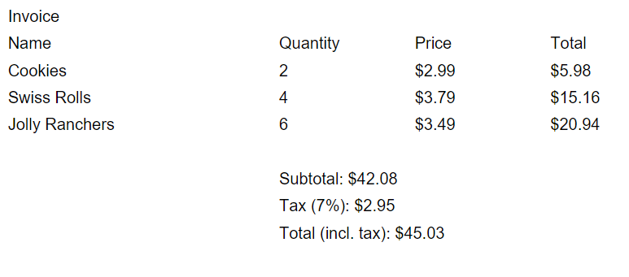

# Invoice Calculator

## Video Demo:  [View on Youtube](https://youtu.be/yNR6ansAq0c?si=AxDi3fC_qxqznXtY)
## Description:
The Invoice Calculator is a robust Python script meticulously crafted to streamline the often cumbersome task of generating invoices for purchased items. Developed with user convenience in mind, this script offers a straightforward command-line interface that empowers users to effortlessly input item details. With just a few simple keystrokes, users can specify the name, quantity, and price of each item, enabling swift and accurate invoice creation.

One of the standout features of the Invoice Calculator is its automatic calculation capabilities. Leveraging sophisticated algorithms, the script dynamically computes the subtotal, tax (set at a standard rate of 7%), and the grand total. This automation not only saves users valuable time but also minimizes the potential for human error, ensuring precise and reliable invoice generation.

Upon finalizing the item entries, the Invoice Calculator proceeds to generate a polished and professional PDF invoice. This meticulously crafted document includes a comprehensive breakdown of all itemized details, presenting them in a clear and organized format. From item names and quantities to individual prices and total amounts, every aspect of the transaction is meticulously captured within the invoice.

The generated PDF invoice serves as a comprehensive record of the transaction, providing users with a tangible document that can be easily saved, printed, or shared as needed. Whether for internal record-keeping or client-facing purposes, the professional presentation of the invoice instills confidence and professionalism in the transaction process.

In addition to its practical functionality, the Invoice Calculator also prioritizes user experience. The script's intuitive interface and straightforward operation make it accessible to users of all skill levels, from seasoned professionals to newcomers in the field of invoicing and accounting. With minimal learning curve, users can quickly adapt to the workflow and harness the full capabilities of the Invoice Calculator.

In summary, the Invoice Calculator represents a sophisticated yet user-friendly solution for generating invoices with efficiency and accuracy. By automating tedious calculations and providing a seamless user experience, this Python script simplifies the invoicing process, empowering users to focus their time and energy on more critical tasks.

## Features
- Generate PDF Invoice: Create a professional-looking PDF invoice with item details.
- Calculate Subtotal: Automatically calculate subtotal, tax (7%), and total (including tax) based on item prices and quantities.
- User-Friendly Interface: Simple command-line interface for entering item details.

## Screenshots

## Usage
1. Run the Script: Execute the invoice.py script using Python.

`python invoice.py`

2. Enter Item Details: Follow the prompts to enter the name, quantity, and price of each item. Enter 'done' to finish adding items or 'list' to display the current invoice details.

3. View Invoice: Once all items are added, the script will generate a PDF invoice named invoice.pdf in the current directory.

## Requirements
- `Python 3.x`
- ReportLab library (install using `pip install reportlab`)

## Getting Started
1. Clone the repository to your local machine.

`git clone https://github.com/your-username/invoice-calculator.git`

2. Install the required dependencies.

`pip install reportlab`

3. Run the script and start generating invoices!

`python invoice.py`

## License
This project is licensed under the MIT License
